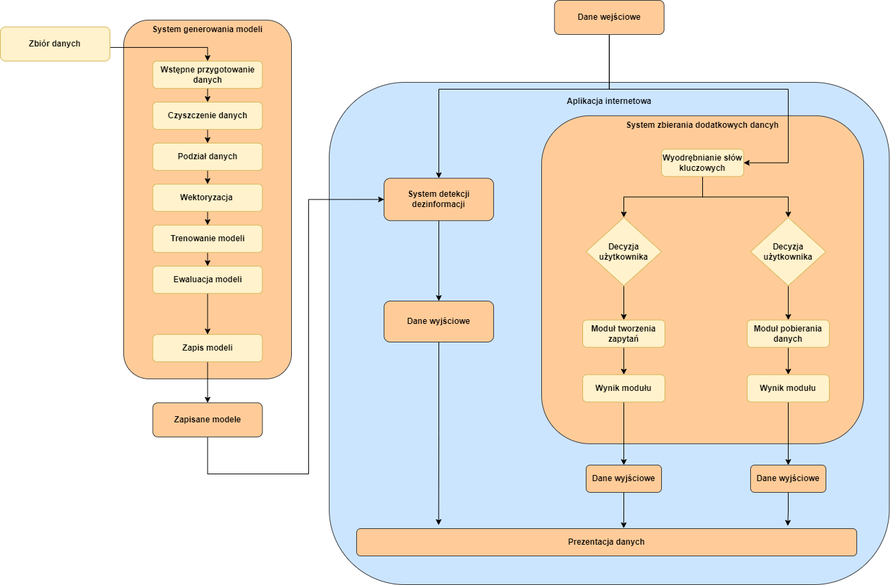

# Projekt oraz implementacja aplikacji internetowej do detekcji dezinformacji bazującej na technikach białego wywiadu

Projekt ten ma na celu stworzenie projektu oraz implementację aplikacji internetowej do detekcji dezinformacji, bazującej na technikach białego wywiadu. W ramach pracy zastosowano techniki uczenia maszynowego w oparciu o 5 modeli klasyfikacji danych, takie jak Random Forest, Logistic Regression, Decision Tree, Gradient Boosting oraz Support Vector Machine. Wymienione modele zostały wytrenowane na istniejących zbiorach danych i połączone z systemem umożliwiającym weryfikację wiarygodności treści. Dodatkowo w trakcie budowy systemu wykorzystano techniki zaawansowanego wyszukiwania treści, oparte na białym wywiadzie oraz web scrapingu. Utworzona aplikacja internetowa integruje wymienione wyżej systemy, tworząc narzędzie, które w przejrzysty i intuicyjny sposób ułatwi proces detekcji.

# Wygląd aplikacji
> Ekran główny

> Ekran analizuj wiadomość

> Ekran wynim analizy

> Moduł tworzenia zapytań

> Moduł wyszukiwania dodatkowych informacji

> Ekran główny

